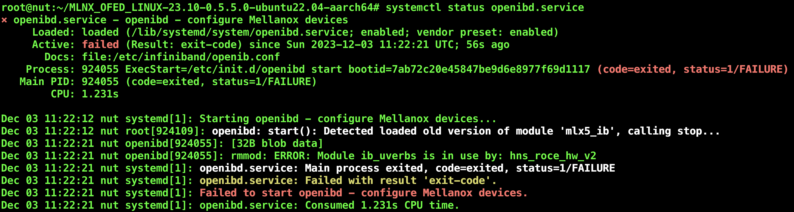

# 操作系统分发节点安装及配置

## 1. 安装操作系统、必要的驱动和 fail2ban 服务
1）给操作系统分发节点安装 Ubuntu 22.04 LTS server 版操作系统，具体的安装说明请参考 [Ubuntu Server 版基础安装文档](https://ubuntu.com/server/docs/installation)
安装完成后，可以给 apt 设置国内的阿里云源或清华大学镜像源来加快软件安装速度，具体操作步骤

```bash
#!/bin/bash

# 备份 source.list 文件
cp /etc/apt/sources.list /etc/apt/sources.list-

# 替换源地址
sed -e 's/archive.ubuntu.com/mirrors.aliyun.com/' /etc/apt/sources.list- > /etc/apt/sources.list

# 更新 apt 源缓存
apt update
```

2）安装 Infiniband 适配卡驱动，从 [https://network.nvidia.com/products/infiniband-drivers/linux/mlnx_ofed/](https://network.nvidia.com/products/infiniband-drivers/linux/mlnx_ofed/) 下载最新的驱动版本。
编译 Infiniband 适配卡驱动需要先装一些必要的软件包（下面的列表仅供参考，很可能会根据版本的更新有所变化，可以编译出错时根据提示安装必要的软件包）。
```bash
# 安装必须的软件包
apt update
apt install net-tools libpython3-dev libfile-find-rule-perl-perl libgfortran5 libnl-route-3-200 libnl-3-200 debhelper lsof libfuse2 autotools-dev gcc make libpci3 libnuma1 gfortran automake pkg-config libnl-3-dev tcl flex libnl-route-3-dev quilt libusb-1.0-0 libltdl-dev swig chrpath dpatch dkms ethtool tk graphviz bison autoconf python3-distutils pciutils m4

# 解压并编译驱动
gzip -dc MLNX_OFED_LINUX-23.10-0.5.5.0-ubuntu22.04-x86_64.tgz | tar xf -
cd MLNX_OFED_LINUX-23.10-0.5.5.0-ubuntu22.04-x86_64/
./mlnxofedinstall --add-kernel-support

# 安装成功后，启动 openibd 服务
systemctl start openibd

# 运行 ip a 命令，查看 ib 卡状态
ip a

# 给 ib 卡手动设置 ip (注意我们的ib卡设备名是 ibs10，这里要根据 ip a 的输出判断实际的 ib 卡设备名)
ifconfig ibs10 12.2.6.102 netmask 255.0.0.0 up
```

### trouble shooting
在启动 openibd 的过程中，有可能会遇到如下错误，这是由于新安装的驱动模块和老的 ib_uverbs 冲突的原因


手动将 ib_uverbs 和依赖它的模块卸载，再启动 openibd 服务即可，首先运行命令
```bash
lsmod | grep ib
```
输出如下
```
libcrc32c              16384  2 btrfs,raid456
ib_uverbs             188416  1 hns_roce_hw_v2
ib_core               438272  2 hns_roce_hw_v2,ib_uverbs
hibmc_drm              24576  0
drm_vram_helper        28672  1 hibmc_drm
drm_ttm_helper         20480  2 hibmc_drm,drm_vram_helper
i2c_algo_bit           20480  1 hibmc_drm
drm_kms_helper        339968  4 hibmc_drm,drm_vram_helper
drm                   659456  6 drm_kms_helper,hibmc_drm,drm_vram_helper,drm_ttm_helper,ttm
libsas                106496  2 hisi_sas_v3_hw,hisi_sas_main
scsi_transport_sas     45056  4 hisi_sas_v3_hw,ses,hisi_sas_main,libsas
```
可以看到 hns_roce_hw_v2 模块依赖于 ib_uverbs，需要首先卸载 hns_roce_hw_v2，再卸载 ib_uverbs
```
rmmod hns_roce_hw_v2 && rmmod ib_uverbs
```
之后再重启 openibd 服务即可。

3）安装配置 fail2ban 服务
```
apt update
apt install fail2ban
```

配置
```
cd /etc/fail2ban
cp jail.conf jail.local
```

修改 jail.local 内容，将 bantime 设置为 10d (默认是 10m）
```
bantime = 10d
```
找到 [sshd]，将 backend 设置为 systemd
```
[sshd]
port    = ssh
logpath = %(sshd_log)s
backend = systemd
```

启动 fail2ban 服务
```
systemctl start fail2ban

# 将 fail2ban 加入默认启动选项
systemctl enable fail2ban
```

## 2. 安装配置 dhcp 和 tfpd 服务器
1）首先安装 [dnsmasq](https://thekelleys.org.uk/dnsmasq/doc.html) 。 dnsmasq 是 Linux 环境下的一款服务器程序，可以同时提供 DNS、DHCP 和 TFTP 三种服务，我们利用这个软件来提供 DHCP 和 TFTP 服务。

```bash
#!/bin/bash
# 安装 dnsmasq
apt update && apt install dnsmasq
```

2）配置 dnsmasq
修改 dnsmasq 配置文件，创建 /etc/dnsmasq.conf.d/pxe.conf
请注意根据实际情况修改 interface 及 mac 地址。并注意，IB卡的 mac 地址不能直接写```ip a``` 命令输出的 mac 地址，而是要用
id:ff:00:00:00:00:00:02:00:00:02:c9:00: + mac地址后8位，例如如果 ip a 的输出结果的 ib 卡部分如下
```
6: ib0: <BROADCAST,MULTICAST,UP,LOWER_UP> mtu 2044 qdisc mq state UP group default qlen 256
    link/infiniband 00:00:07:9a:fe:80:00:00:00:00:00:00:3a:70:ed:a3:00:27:ff:19 brd 00:ff:ff:ff:ff:12:40:1b:ff:ff:00:00:00:00:00:00:ff:ff:ff:ff
    altname ibp177s0
    altname ibs21
    inet 12.2.24.14/8 brd 12.255.255.255 scope global dynamic ib0
       valid_lft 450sec preferred_lft 450sec
    inet6 fe80::1270:fd03:17:cc80/64 scope link
       valid_lft forever preferred_lft forever
``` 
则 ib 卡的 mac 地址应为
```
id:ff:00:00:00:00:00:02:00:00:02:c9:00:3a:70:ed:a3:00:27:ff:19
```

pxe.conf 文件的内容大致如下
```txt
interface=ens129f0,ibs10,lo
bind-interfaces
dhcp-range=ens129f0,128.1.0.0,128.255.0.0
dhcp-range=ibs10,12.1.0.0,12.255.0.0

dhcp-host=61:51:2F:1E:1F:30,128.2.6.101
dhcp-host=61:61:2F:1D:1B:40,128.2.6.103
dhcp-host=61:61:2F:1D:1A:6C,128.2.6.104
dhcp-host=61:61:2F:1D:16:94,128.2.6.105
dhcp-host=61:61:2F:17:F1:E8,128.2.6.106
dhcp-host=61:61:2F:17:F4:6C,128.2.6.107
dhcp-host=61:61:2F:12:FC:D0,128.2.6.108
dhcp-host=61:4F:A6:1E:BF:B0,128.2.6.109
dhcp-host=70:94:49:32:E5:96,128.1.7.105
dhcp-host=70:16:3A:1E:2C:14,128.1.7.106
dhcp-host=70:94:49:02:E7:2A,128.1.7.107

dhcp-host=id:ff:00:00:00:00:00:02:00:00:02:c9:00:08:c0:eb:03:00:39:a4:04,12.2.6.101
dhcp-host=id:ff:00:00:00:00:00:02:00:00:02:c9:00:08:cd:eb:03:00:78:a3:a4,12.2.6.102
dhcp-host=id:ff:00:00:00:00:00:02:00:00:02:c9:00:10:7e:fd:03:00:1a:cc:98,12.2.6.103
dhcp-host=id:ff:00:00:00:00:00:02:00:00:02:c9:00:10:7e:fd:03:00:1b:cc:90,12.2.6.104
dhcp-host=id:ff:00:00:00:00:00:02:00:00:02:c9:00:10:7e:fd:03:00:1c:cc:80,12.2.6.105
dhcp-host=id:ff:00:00:00:00:00:02:00:00:02:c9:00:34:a8:e8:61:1c:35:83:76,12.1.6.106
dhcp-host=id:ff:00:00:00:00:00:02:00:00:02:c9:00:34:a8:e8:61:1c:37:83:78,12.1.6.107
dhcp-host=id:ff:00:00:00:00:00:02:00:00:02:c9:00:24:a8:e8:61:1c:35:83:71,12.1.6.108
dhcp-host=id:ff:00:00:00:00:00:02:00:00:02:c9:00:24:a8:e8:61:1c:3a:b6:91,12.1.6.109
dhcp-host=id:ff:00:00:00:00:00:02:00:00:02:c9:00:24:a8:e8:61:1c:3a:b6:92,12.1.7.105
dhcp-host=id:ff:00:00:00:00:00:02:00:00:02:c9:00:24:a8:e8:61:1c:35:8b:93,12.1.7.106
dhcp-host=id:ff:00:00:00:00:00:02:00:00:02:c9:00:24:a8:e8:61:1c:35:8b:94,12.1.7.107

dhcp-match=set:efi-x86_64,option:client-arch,9
dhcp-match=set:efi-bc,option:client-arch,7
dhcp-match=set:legacy,option:client-arch,0
dhcp-match=set:efi-arm64,option:client-arch,11

dhcp-boot=tag:efi-x86_64,amd64/bootx64.efi
dhcp-boot=tag:efi-bc,amd64/bootx64.efi
dhcp-boot=tag:legacy,amd64/pxelinux.0
dhcp-boot=tag:efi-arm64,arm64/bootaa64.efi

enable-tftp
tftp-root=/srv/tftp

# 设置上级 DNS 服务器
server=162.105.129.27
```
## 3. 为远程网卡启动提供引导加载程序
1）访问 [http://cdimage.ubuntu.com/ubuntu-server/daily-live/current/](http://cdimage.ubuntu.com/ubuntu-server/daily-live/current/)
找到适合自己平台的 Netboot tarball 并下载，比如如果是 amd64 平台，可以下载
[64-bit PC (AMD64) netboot tarball](http://cdimage.ubuntu.com/ubuntu-server/daily-live/current/noble-netboot-amd64.tar.gz)

2）解压缩
```
gzip -dc noble-netboot-amd64.tar.gz | tar xf -
```
运行完上述命令后会在当前目录下出现 amd64 目录，里面的内容大致如下
```
root@localhost:~# ls amd64/
bootx64.efi  grub  grubx64.efi  initrd  ldlinux.c32  linux  pxelinux.0  pxelinux.cfg
```

3）将 amd64 下的文件移至 tftp 服务目录
```
mv amd64/* /srv/tftp/
```

## 4. 修改主机 /etc/hosts 文件
给 /etc/hosts 文件加入计算节点的 ip 和主机名。dnsmasq 的 dns 服务器默认会读取 /etc/hosts 文件中的记录，这样计算节点启动后主机名就会根据 dns 的记录设置成相应的名字。
/etc/hosts 文件内容如下
```
127.0.0.1 localhost
128.2.6.101     c02b06n02a
128.2.6.102     c02b06n02b
128.2.6.103     c02b06n02c
128.2.6.104     c02b06n02d
128.2.6.105     c02b06n03a
128.2.6.106     c02b06n03b
128.2.6.107     c02b06n03c
128.2.6.108     c02b06n03d
128.2.6.109     910b
128.1.7.105     c01b07n05
128.1.7.106     c01b07n06
128.1.7.107     c01b07n07
```

## 5. 停止系统自带的域名服务并重启 dnsmasq
```bash
systemctl stop systemd-resolved.service
systemctl disable systemd-resolved.service

systemctl restart dnsmasq.service
```

## 6. 安装和配置 nfs 服务器
1）安装 nfs 服务器
```bash
apt-get update
apt install nfs-kernel-server
```

2）修改 nfs 配置文件 /etc/exports，内容如下
```
# nfsv4
/srv/bioland/jammy       128.0.0.0/8(rw,no_root_squash,sync,no_subtree_check)
```

3）重启 nfs 服务
```
systemctl restart nfs-kernel-server
```

## 7. 配置网络启动(uefi模式)的 grub
修改 /srv/tftp/grub/grub.cfg，文件内容如下
```
set default="0"
set timeout=20

menuentry "Ubuntu 22.04 amd64" {
        set gfxpayload=keep
        linux /vmlinuz-5.15.126-amd64 root=/dev/nfs rw nfsroot=128.1.7.106:/srv/bioland/jammy,vers=3,tcp ip=dhcp net.ifnames=0 biosdevname=0 nomodeset rdblacklist=nouveau intel_iommu=off
        initrd /initrd.img-5.15.126-amd64
}
```

